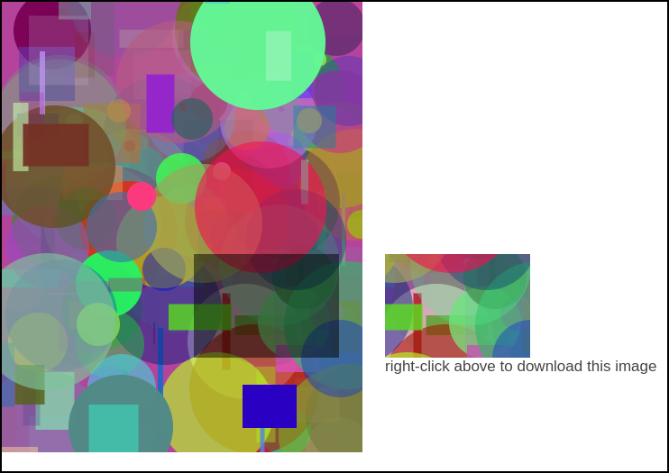

# Canvas region to image

## How to generate an image from a user-selected region of a canvas

This page was written as part of an answer to a Stack Overflow question:

[Save only a certain part of an HTML canvas](http://stackoverflow.com/questions/32256567/save-only-a-certain-part-of-an-html-canvas/)

Each time you load the page, a random scene is painted on a canvas. You
can click and drag on the canvas to select a region to be made into an
image. The generated image is shown to the right of the canvas.

