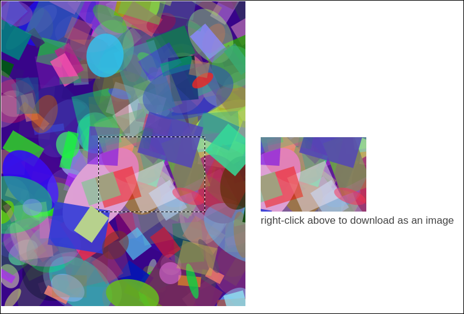

# Canvas region to image

## How to generate an image from a user-selected region of a canvas

This page is a refined version of my answer to a Stack Overflow question:

[Save only a certain part of an HTML canvas](http://stackoverflow.com/a/32256895/4275347)

Each time you load the page, a random scene is painted on a canvas. You
can click and drag to select a canvas region which is made into an
image. The generated image appears to the right of the canvas, and can
be downloaded like any image that appears on a web page.

Canvas clipping is done the same way as in my Stack Overflow answer. The
code has been refactored into a module, the target painting has been
randomized further, and the gray selection box has been replaced with
a marquee effect.

